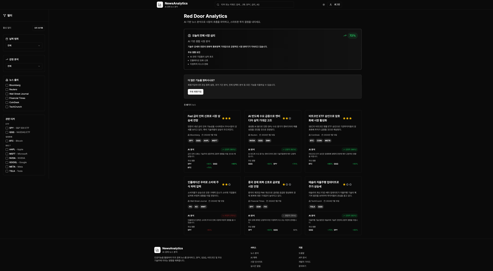

# 📈 Red door

## 프로젝트 소개

Red door 프로젝트는 미국 경제 뉴스를 주기적으로 크롤링하고, 이를 기반으로 SPY, QQQ과 같은 ETF와, 비트코인, Big7(애플, 마이크로소프트, 엔비디아 등)과 같은 자산에 미치는 영향을 LLM 챗봇
API를 통해 분석하는 서비스입니다.

자신이 등록한 자산에 긍정적인 영향을 미칠 뉴스인지 확인하고, 영어로 된 뉴스를 한국어로 번역 및 요약하여 빠르게 뉴스를 볼 수 있는 서비스를 제공하는 것을 목표로 합니다.

## 계획

- 1차 : 뉴스 스크래핑 및 AI 요약 및 사용자 관심 종목 등록 구현
- 2차 : 알림 기능 구현 및 속보 혹은 주요 뉴스 사용자에게 알림으로 전달
- 3차 : (TODO)

## MVP 예상

